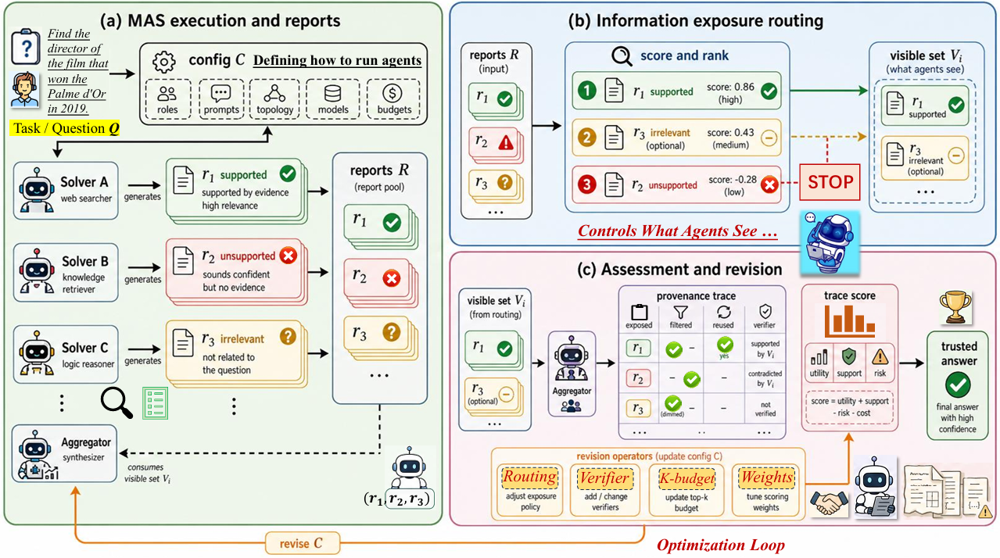
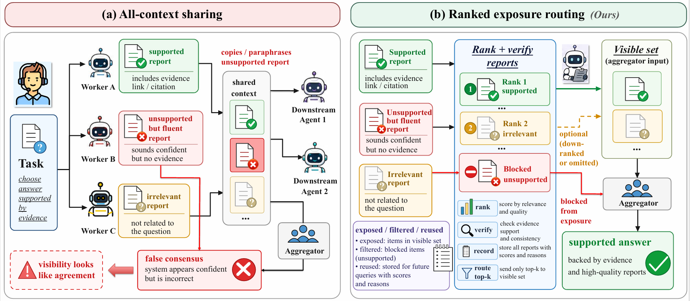

# TRACE-MAS

## This is an anonymous GitHub repository for double-blind IPMC conference submission; all potential author-identifying information has been redacted.

**Trustworthy Routing and Assessment for Configuration-Evolved Multi-Agent Systems**

TRACE-MAS is a research prototype for building multi-agent reasoning systems
that control what intermediate reports are exposed to downstream agents. It
keeps the configuration-based MAS runtime, but adds report routing, provenance
records, integrity-aware scoring, verifier insertion, and bounded self-revision
so that unsupported intermediate evidence is less likely to be amplified into a
false consensus.

This repository contains the code, runnable scripts, paper figures, and LaTeX
table sources used for the TRACE-MAS manuscript.

<p align="center">
  
</p>

## What TRACE-MAS Adds

TRACE-MAS focuses on the evidence flow inside a multi-agent system. Instead of
letting every downstream agent read every upstream report, it asks which reports
should be visible, how those reports were produced, and whether a proposed
configuration improves both task performance and evidence integrity.

- **Exposure-aware routing:** ranks and filters intermediate reports before
  they are sent to downstream agents.
- **Trace records:** stores visible reports, selected reports, report reuse, and
  verifier decisions as provenance signals.
- **TRACE Score:** evaluates candidate configurations using task accuracy,
  unsupported-consensus risk, hallucination cascade risk, evidence precision,
  and cost.
- **Trace-guided self-revision:** uses failed traces to adjust routing budgets,
  verifier placement, and aggregation policies.

<p align="center">
  
</p>

## Result Snapshot

The table below summarizes the main paper result. Values are task accuracy or
issue-resolution rate in percent. The full LaTeX table is available at
[`source/tables/main_results.tex`](source/tables/main_results.tex).

| Method | BBEH | WorkBench | SWE-Lite | SWE-Verified |
|---|---:|---:|---:|---:|
| EvoMAS (LLM-selection) | 58.7 | 48.9 | 52.9 | 63.8 |
| TRACE-MAS (LLM-selection) | **59.3** | **50.8** | **55.8** | **65.0** |

TRACE-MAS is designed for noisy evidence settings, so the paper also evaluates
unsupported consensus risk (UCR), noisy evidence reuse (NER), and evidence
precision (EPrec). The routing and verifier modules reduce UCR and NER while
improving final task accuracy.

| Setting | Method | Acc. | UCR | NER | EPrec |
|---|---|---:|---:|---:|---:|
| Noisy-BBEH | All-context sharing | 41.57 | 36.8 | 29.4 | 50.8 |
| Noisy-BBEH | TRACE routing + verifier | **47.53** | **9.2** | **7.0** | **76.8** |
| Noisy-WorkBench | All-context sharing | 38.17 | 34.5 | 28.6 | 51.8 |
| Noisy-WorkBench | TRACE routing + verifier | **44.53** | **10.2** | **7.8** | **74.5** |

## Repository Layout

```text
TRACE-MAS-GITHUB/
  main.py                         # TRACE-MAS runner
  requirements.txt                # Python dependencies
  scripts/
    common.sh                     # shared defaults
    prepare_datasets.sh           # benchmark preparation
    run_bbeh.sh                   # BBEH runner
    run_workbench.sh              # WorkBench runner
    run_swebench.sh               # SWE-bench runner
  src/
    trace_mas/                    # TRACE revision operators
    topology/                     # routing, ranking, context merge helpers
    prompts/templates/            # method-level prompt templates
    meta_model/                   # configuration proposer and memory logic
    mas/                          # MAS interpreter
    dataset/                      # benchmark adapters
  mas_pools/trace_mas/            # seed TRACE-MAS configurations
  source/
    figures/                      # paper figures for README and reproducibility
    tables/                       # LaTeX table sources
```

Some output paths still use the legacy stem `evomas` internally so existing
evaluators and scripts can locate final configurations without additional
adapters.

## Installation

The code was developed with Python 3.11.

```bash
conda create -n trace-mas python=3.11 -y
conda activate trace-mas
pip install -r requirements.txt
```

The default scripts call Python through `conda run -n "$CONDA_ENV"`. Either set
`CONDA_ENV=trace-mas` when running scripts or create the environment with the
default name `mas`.

TRACE-MAS can use Bedrock, OpenAI-compatible, and other provider backends
through the model IDs configured in the scripts and YAML files. Configure the
credentials for the providers you use through their standard environment
variables or credential files. For AWS Bedrock, the normal AWS credential chain
is used.

## Prepare Benchmarks

Task data is not fully shipped with the repository. Run the preparation script
from the repository root:

```bash
CONDA_ENV=trace-mas bash scripts/prepare_datasets.sh
```

Useful flags:

```bash
bash scripts/prepare_datasets.sh --force
bash scripts/prepare_datasets.sh --skip-repos
bash scripts/prepare_datasets.sh --bbeh-only
bash scripts/prepare_datasets.sh --workbench-only
bash scripts/prepare_datasets.sh --swe-only
bash scripts/prepare_datasets.sh --repos-only
```

On Windows, run the shell scripts from WSL, Git Bash, or another Bash-compatible
environment.

## Quick Start

Run a one-task smoke test on BBEH:

```bash
CONDA_ENV=trace-mas NUM_EVAL_TASKS=1 MAX_STEPS=1 WORKERS=1 \
  bash scripts/run_bbeh.sh mini
```

Run a WorkBench subdomain:

```bash
CONDA_ENV=trace-mas NUM_EVAL_TASKS=10 MAX_STEPS=2 WORKERS=4 \
  bash scripts/run_workbench.sh email
```

Run SWE-bench Lite or Verified:

```bash
CONDA_ENV=trace-mas NUM_EVAL_TASKS=5 MAX_STEPS=1 WORKERS=1 \
  bash scripts/run_swebench.sh lite
```

Each script writes logs and task outputs under
`$OUTPUT_ROOT/<dataset>_main/`. The default `OUTPUT_ROOT` is `output_paper`;
override it if you want separate experiment folders.

## Direct CLI Usage

The shell scripts call `main.py` with resolved defaults. You can also run the
pipeline directly:

```bash
python main.py --dataset bbeh_mini \
  --num-eval-tasks 1 \
  --max-steps 1 \
  --workers 1 \
  --output-dir output/debug_bbeh
```

Common arguments:

| Argument | Meaning |
|---|---|
| `--dataset` | Dataset name, such as `bbeh_mini`, `workbench_email`, or `swe_bench_lite`. |
| `--num-eval-tasks` | Number of evaluation tasks to run. |
| `--max-steps` | Number of configuration revision steps. |
| `--num-parents` | Number of candidate configurations selected from the pool. |
| `--meta-model-id` | Model used for configuration selection and revision. |
| `--model-list` | Worker model palette available to MAS agents. |
| `--llm-as-judge` | Judge model used for reward signals where applicable. |
| `--task-ids` | Optional explicit task indices or SWE-bench instance IDs. |
| `--memory-path` | Optional memory JSON path for continuing a prior run. |
| `--memory-evolution` | Whether to persist memory updates. |
| `--batch-size` | Number of tasks per shared search batch. |
| `--workers` | Number of parallel batches. |

## Script Parameters

Every run script sources [`scripts/common.sh`](scripts/common.sh). Override any
default by setting an environment variable before the command.

| Variable | Default | Description |
|---|---|---|
| `CONDA_ENV` | `mas` | Conda environment used by the scripts. |
| `NUM_EVAL_TASKS` | full selected dataset | Number of tasks to run. |
| `MAX_STEPS` | `2` | Configuration revision steps per batch. |
| `NUM_PARENTS` | `2` | Candidate configurations selected per batch. |
| `SEED` | `42` | Random seed. |
| `BATCH_SIZE` | `1` | Tasks per search batch. |
| `WORKERS` | `16` | Parallel batches. |
| `META_MODEL` | Claude Sonnet 4.5 Bedrock ID | Configuration selection and revision model. |
| `JUDGE_MODEL` | same as `META_MODEL` | LLM-as-judge model. |
| `AGENT_MODELS` | Claude 3.5 Sonnet, Qwen3-235B, Qwen3-Coder-480B | Space-separated worker model IDs. |
| `MEMORY_EVOLUTION` | `true` | Persist memory updates. |
| `MEMORY_PATH` | auto-generated | Existing memory file to continue from. |
| `OUTPUT_ROOT` | `output_paper` | Root directory for run outputs. |

Examples:

```bash
# Use a single worker model.
CONDA_ENV=trace-mas \
AGENT_MODELS="bedrock:us.anthropic.claude-3-5-sonnet-20241022-v2:0" \
NUM_EVAL_TASKS=20 bash scripts/run_bbeh.sh boolean_expressions

# Continue from an existing memory file.
CONDA_ENV=trace-mas \
MEMORY_PATH=dataset/bbeh/benchmark_tasks/bbeh_mini/memory_previous.json \
bash scripts/run_bbeh.sh mini
```

## Citation

```bibtex
@misc{anonymous2026tracemas,
  title        = {TRACE-MAS: Trustworthy Routing and Assessment for Configuration-Evolved Multi-Agent Systems},
  author       = {Anonymous Authors.},
  year         = {2026},
  note         = {The first conference of IPMC [2026]}
}
```

## License

This project is released under the [CC BY-NC 4.0](LICENSE) license. You may
share and adapt the material for non-commercial purposes with appropriate
credit. Commercial use is not permitted.

## Acknowledgment

TRACE-MAS builds on configuration-based multi-agent system components and
benchmark adapters inspired by EvoMAS: https://github.com/amazon-science/EvoMAS. We thanks for their contribution. The method-specific additions in this
repository are the report-routing layer, trace records, verifier prompts,
TRACE-style scoring, and bounded self-revision operators.
